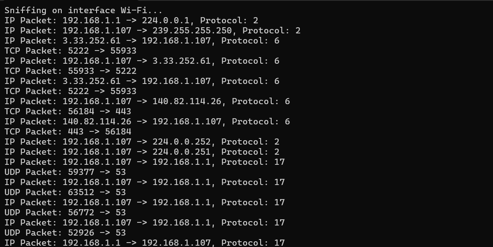

# NETWORK SNIFFER

## Description
This Python script captures and analyzes network traffic, allowing users to understand how data flows on a network and how network packets are structured. It utilizes the Scapy library for packet sniffing and analysis.

## Installation
1. Make sure you have Python installed on your system.
2. Install the required dependencies by running: pip install scapy
3. Clone this repository to your local machine: git clone https://github.com/dhruviil19/NETWORK-SNIFFER.git

## Usage
1. Navigate to the project directory.
2. Run the script by executing the following command: python network.py
3. Follow the on-screen instructions to specify the network interface to sniff on.

## Features
- Capture and analyze network traffic.
- Display information about IP packets, TCP packets, and more.

## Example Output

## License
This project is licensed under the MIT License. See the [LICENSE](LICENSE) file for details.

## Acknowledgements
- Thanks to the Scapy development team for their powerful packet manipulation library.

## Contact Information
For questions or inquiries about this project, please contact [Dhruvil Bhalani].
